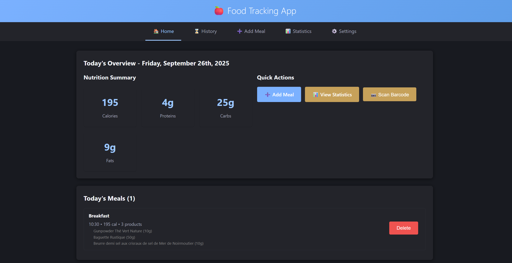

[](https://github.com/tdouillard/food-tracking/actions/workflows/ci.yml)
[](https://codecov.io/gh/tdouillard/food-tracking)

# 🍎 Food Tracking Web App

Modern, modular Progressive Web App (PWA) to track meals, nutrition, and daily food habits. Focused on speed (Vite), maintainability (component folders with HTML/CSS/JS separation), and user experience (offline, theming, responsive layout).



---

## ✨ Current Features

### Core

- 🍽️ Add meals with multiple products and quantities
- 🔍 OpenFoodFacts product search integration
- 📊 Daily / historical statistics (calories, macros, trends)
- � Meal history with quick sidebar add form
- 📈 Charts for visual analytics

### UX & Platform

- 📱 PWA (installable, offline capable, service worker caching)
- 🎨 Theme system with light/dark toggle + system preference detection
- ⚡ Fast navigation via lightweight hash router
- ♻️ Local persistence via custom `StorageService`
- 🧱 Modular components: each page has its own HTML, CSS, JS

### Data / Extensibility

- 🗃️ Structured storage abstraction (ready for remote backend)
- 📄 Import/export (JSON snapshots in repo examples)
- 🔌 Clean service layer for API integrations (OpenFoodFacts)

---

## 🗂️ Project Structure (Simplified)

```
src/
   main.js                # App bootstrap
   style.css              # Global styles & theme variables
   components/
      App.js               # Root app (routing + layout + theme toggle)
      HomePage/
         HomePage.html
         HomePage.css
         HomePage.js
      AddMealPage/
         AddMealPage.html
         AddMealPage.css
         AddMealPage.js
      MealHistoryPage/
         MealHistoryPage.html
         MealHistoryPage.css
         MealHistoryPage.js
      StatsPage/
         StatsPage.html
         StatsPage.css
         StatsPage.js
      SettingsPage/
         SettingsPage.html
         SettingsPage.css
         SettingsPage.js
   services/
      StorageService.js
      OpenFoodFactsService.js
   utils/
      Router.js
public/
   manifest.json
   sw.js
```

---

## 🎨 Theming & Dark Mode

All colors and layout tokens use CSS custom properties defined in `style.css`. Dark mode is applied either by system preference (`prefers-color-scheme`) or manually via the toggle (adds `theme-dark` class + optional smooth transitions).

Extended theming instructions & variable reference live in: [`README-THEME.md`](./README-THEME.md)

---

## 🚀 Getting Started

### Requirements

- Node.js 18+ recommended (works on 16+)

### Setup

```bash
git clone https://github.com/tdouillard/food-tracking.git
cd food-tracking
npm install
npm run dev
```

Visit: http://localhost:3000

### Production

```bash
npm run build
npm run preview
```

---

## �️ Scripts

| Command            | Description                                |
| ------------------ | ------------------------------------------ |
| `npm run dev`      | Start development server (Vite)            |
| `npm run build`    | Production build                           |
| `npm run preview`  | Preview production build locally           |
| `npm run prebuild` | (Reserved) run any pre-build tasks/scripts |
| `npm run lint`     | Run ESLint                                 |
| `npm run lint:fix` | Auto-fix ESLint issues                     |
| `npm run test`     | Run tests in watch mode (Vitest)           |
| `npm run test:run` | Run tests once                             |
| `npm run coverage` | Run tests with coverage report             |

---

## �📖 Usage Overview

### Add a Meal

1. Go to Add Meal
2. Search products (OpenFoodFacts)
3. Set quantity / portion
4. Add multiple items
5. Save & view aggregated nutrition

### View Stats

1. Open Statistics
2. Review charts (macros, calories, counts)
3. Filter by period (planned extension)

---

## 🏗️ Tech Stack

- Vite (dev/build)
- Vanilla ES Modules (no framework overhead)
- Service Worker (PWA)
- CSS custom properties for design tokens
- Simple hash router
- (Planned) Chart.js integration refinements using theme variables

---

## 🔮 Roadmap / TODO

Short-term refactors:

- [ ] Create subcomponents to avoid repeated card HTML markup
- [x] Add theme toggle (light/dark + transitions)
- [ ] Replace stats textual labels with icons & add meal image preview
- [ ] Introduce reusable stat tile component

Feature enhancements:

- [ ] User authentication (session + secure storage abstraction)
- [ ] Remote sync backend integration
- [ ] Weight tracker API integration (e.g. Withings) for metabolic insights
- [ ] Advanced filtering (weekly / monthly aggregation + custom ranges)
- [ ] High-contrast accessibility theme
- [ ] Chart color theming (bind to CSS variables)

Data & UX:

- [ ] Drag & drop meal reordering
- [ ] Duplicating previous meals / templates
- [ ] Barcode scanning (mobile camera integration)

Infrastructure:

- [ ] Unit tests for services & router
- [ ] Lighthouse / performance pass
- [ ] Optional module federation / plugin loader (future)

---

## 🤝 Contributing

PRs welcome. Please keep components modular (HTML/CSS/JS grouped). Avoid inline styles; prefer CSS variables. File an issue for larger architectural proposals first.

---

## � Privacy

Local-first by default. No analytics. Data only leaves device if a future remote sync feature is explicitly enabled.

---

## 📝 License

MIT – see [LICENSE](./LICENSE)

---

Built with ❤️ for sustainable, mindful eating.
